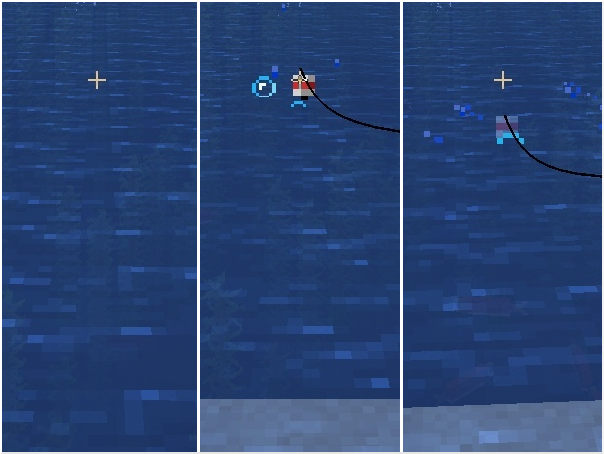
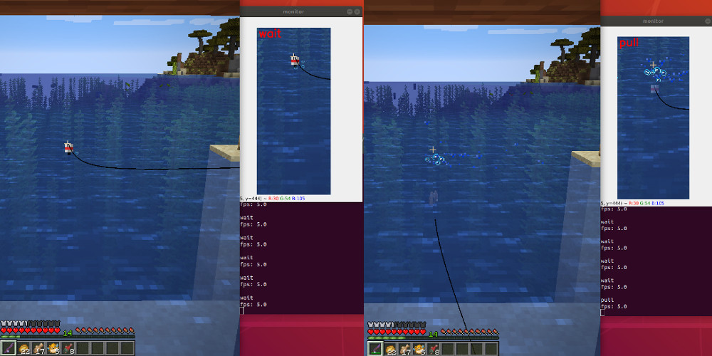
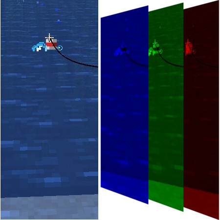
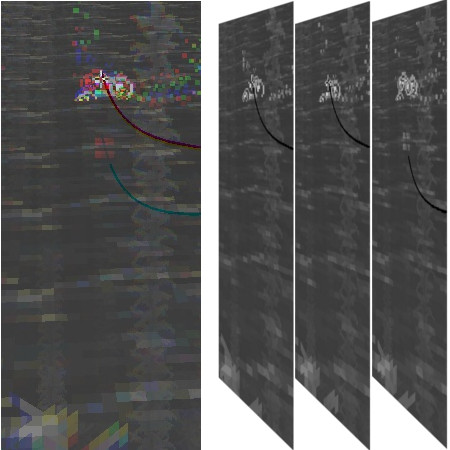
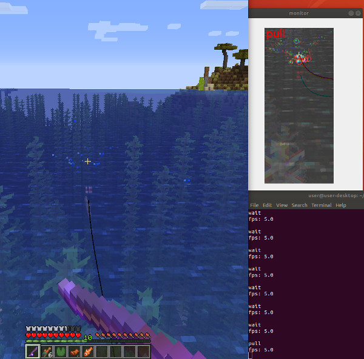

# How was this project made?

Requirement for bot:
Trained bot should be able to automate fishing in Minecraft. Fishing includes three actions: casting line, waiting and pulling line. This can be solved as image classification problem.

(cast, wait and pull)

 

To keep things simple I used supervised learning and did copy the layer structure from TensorFlow image classification tutorial ([Tutorial](www.tensorflow.org/tutorials/images/classification)). This should be enough for this simple task.

I started by collecting images while fishing. `main()` function in`train_model/collect_data.py` was used to capture screen shots and store them in `Unlabeled_Frames/` folder.

Labeling frames was done using `train_model/label_data.py` which takes picture from `Unlabeled_Frames/` folder, shows it and asks user input to store it in correct class folder in `Labeled_Frames/`. Possible classes for picture are cast, wait and pull.

Model was trained using `train_model/train_classifier.py` which is copy from TensorFlow tutorial.

Trained model can be used to catch fish with `main.py`.

 

At first I was not including any pictures at night so it did not work on all light conditions. But model did work really well on daylight.

To automate data collection and labeling I used  `collect_simple_data_with_model()` from `train_model/collect_data.py`. Function uses trained model to collect more screen shots while it is fishing. After model had collected new data I re-labeled all incorrectly labeled pictures and re-trained the model. With more examples model become much more robust on all light conditions.

At this point requirements for this project were met, I had automated fishing.

 

But I still wanted to push this project just a little more. 
I was using color pictures during training and prediction, but I do not think that colors are important here. More important than colors is the float movement. 

Plan was to replace picture color channels with multiple grayscale pictures.

Demonstration:

 
(color picture and separated color channels || "color" picture with grayscale pictures as color channels)

For me this is inspired by Deep Minds Atari DQN.

To collect these stacked grayscale pictures I used  `collect_stacked_data_with_model()` from `train_model/collect_data.py`. It uses earlier trained model to automate data collection.

This method did work in game, but I did not collect as many pictures as to earlier model. I would guess that with more data this method leads to more generalized fishing bot, but since I already had well working model I did not push this project any further.
